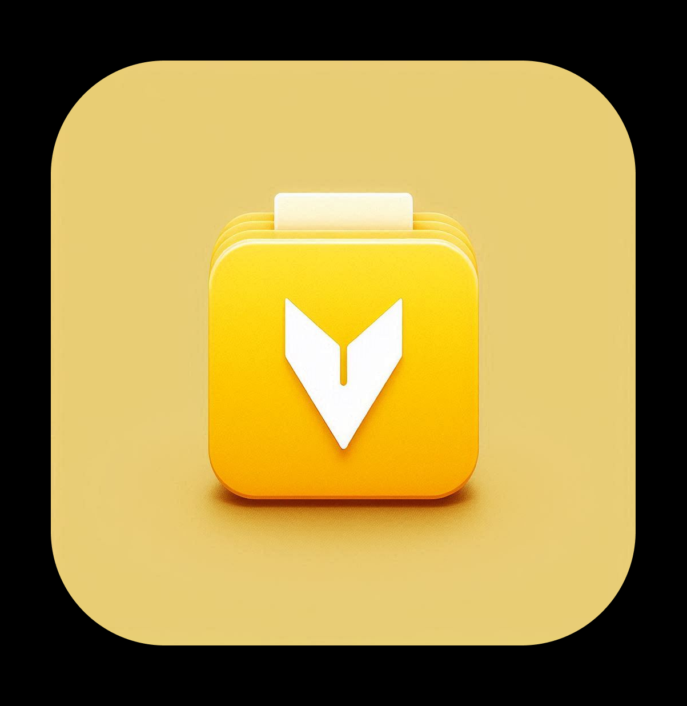
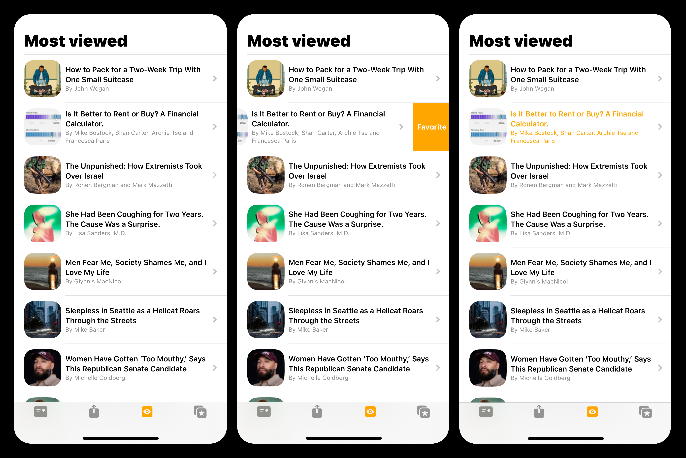

# my_vrg

 

# my_vrg - is a NYTimes articles mobile app.
The API from the website https://developer.nytimes.com is used to access the articles. 
The app allows you to get access to the latest articles that you can add to your favorites and come back to them whenever you need. 

## Frameworks

- SwiftUI: is used to build the interface.
- Alamofire: is used to send requests and get responses.
- Core Data: is used to save the data of articles to the "Favorites" tab.
- WebKit: is used to view the web pages of the articles. 

## What you can do with our app 

### Review articles 

You can open the app and select the category of the articles (**Most emailed, Most shared, Most viewed**). Have a brief overview of articles under each category and open any article to get the full access to the content. 

### Add to favorites 

To add some articles to the favorites simply swipe left. To verify that your article has been added to the favorites will be a change of color of the article title to yellow. 
Switching between tabs of the categories will erase the yellow highlight.
Your favorite articles will be available in the section "Favorites". 

### Deleting from favorites

Make sure the section "Favorites" is open, then swipe left the added article. The article will be deleted from your "Favorites".

[IOS Internship.pdf](https://github.com/user-attachments/files/15792587/IOS.Internship.pdf)
